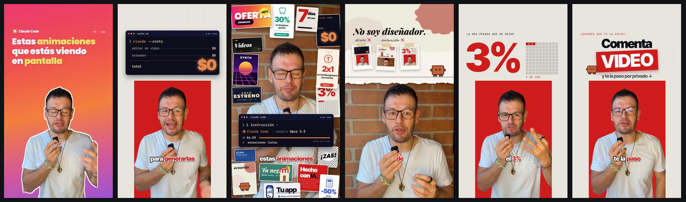
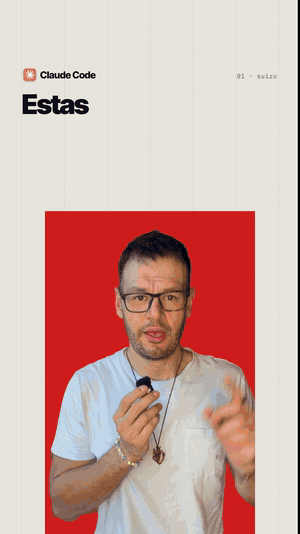

# reel-motion — skill de Claude Code

Le pasas un video tuyo hablando a cámara y te lo devuelve convertido en un reel **animado con código**:
te recorta del fondo, te monta sobre una tarjeta de color y arma alrededor titulares, terminales, papel
rasgado, collage, contadores, subtítulos, música y efectos, **cada cosa entrando justo cuando dices la palabra.**

Sin editor. Sin animador. Tú grabas y apruebas.

Hecha por [Diego Osorio](https://instagram.com/soydiegoosorio).

  





## Instalar (copia y pega esto en Claude Code)

```
Instala esta skill de Claude Code: clónala desde https://github.com/diegodoc11/reel-motion dentro de ~/.claude/skills/reel-motion y corre su instalador (scripts/instalar.py). Si falta algún programa, instálalo conmigo paso a paso.
```

Claude clona la skill, crea su propio entorno, descarga los modelos (unos 4 GB en total) y revisa que tengas
ffmpeg, Node.js y whisper.cpp. Si falta algo, te dice qué instalar.

¿Prefieres hacerlo a mano? En Windows (PowerShell):

```powershell
git clone https://github.com/diegodoc11/reel-motion "$HOME\.claude\skills\reel-motion"
python "$HOME\.claude\skills\reel-motion\scripts\instalar.py"
```

En Mac o Linux:

```bash
git clone https://github.com/diegodoc11/reel-motion ~/.claude/skills/reel-motion
python3 ~/.claude/skills/reel-motion/scripts/instalar.py
```

## Usarla

Graba tu video, ábrelo en Claude Code y dile:

```
Anima este video con reel-motion: C:\Videos\mi-video.mp4
```

Claude hace todo esto solo:

1. **Limpia el video**: quita los silencios largos y las frases que repetiste por equivocarte.
2. **Transcribe** palabra por palabra, con el segundo exacto de cada una.
3. **Te recorta del fondo** (como una pantalla verde, pero sin pantalla verde).
4. **Diseña las escenas**: una idea por escena, cada pieza entra cuando la nombras.
5. **Revisa su propio trabajo** antes de mostrártelo: que nada te tape la cara y que todo el texto quepa.
6. Te entrega un **borrador**. Pides cambios. Cuando apruebas, **exporta el final** en 1080×1920 a 60 cuadros.

## Qué puedes pedirle

- "Cambia el rojo por el azul de mi marca."
- "Ponle esta música" (deja tu canción en `recursos/musica/` dentro de la skill, o pásale la ruta).
- "Cuando digo *mis resultados*, muestra estas fotos."
- "El título del principio más corto."
- "Que el cierre diga *Comenta GUÍA*."

## Qué necesitas

| | Para qué | Costo |
|---|---|---|
| Claude Code con plan de pago | quien arma el reel | tu plan |
| Python 3.10+, Node.js 20+, ffmpeg, whisper.cpp | el motor | gratis |
| ~4 GB de disco | modelos de transcripción y de recorte | gratis |
| Tarjeta gráfica (opcional) | que el recorte tarde minutos y no horas | — |

No pide llaves ni cuentas de terceros: la transcripción, el recorte y el render corren en tu computador.

Probada en Windows 11 con tarjeta NVIDIA. En Mac y Linux está preparada para funcionar (usa CoreML o el
procesador), pero ahí se ha probado menos: si algo falla, abre un *issue* con el error.

## Cómo grabar para que quede mejor

- **Vertical**, tú solo, mirando a cámara.
- **Cabeza y pecho** en cuadro, con la barbilla más o menos a la mitad. Si te grabas muy cerca, queda menos espacio para animar.
- Fondo sencillo y buena luz: el recorte sale más limpio.
- Si te equivocas, **repite la frase completa** y sigue. La skill corta la toma mala.

## Preguntas

**¿Cuánto tarda?** Un video de un minuto, en un portátil con tarjeta gráfica: unos 10 minutos preparándolo,
unos 10 recortándote, y el render final unos 8. En medio, Claude diseña y revisa las escenas. La primera vez
súmale la descarga de los modelos.

**¿Cuánto gasta de mi plan de Claude?** Depende del largo del video y de cuántas vueltas de ajustes pidas.
Lo pesado (transcribir, recortar, renderizar) corre en tu computador y no gasta tokens.

**¿Trae música?** No, por derechos de autor. Baja una pista libre de derechos (por ejemplo de
[Pixabay Music](https://pixabay.com/music/)) y déjala en `recursos/musica/`. Los efectos de sonido sí vienen incluidos.

**¿Sirve para videos horizontales o de pantalla grabada?** No. Es para una persona hablando a cámara en vertical.

**¿En qué se diferencia de las otras skills de video?**

| Skill | Tú en el video | Para qué |
|---|---|---|
| **reel-motion** (esta) | Grabado y recortado dentro de un diseño animado | Reels que se ven producidos por un estudio |
| [video-imperio-edit](https://github.com/diegodoc11/video-imperio-edit) | Grabado, a pantalla completa | Edición clásica: zooms, subtítulos, material de apoyo |
| [anuncios-animados](https://github.com/diegodoc11/anuncios-animados) | No apareces | Anuncio animado a partir de un guion, con voz de IA |

## Qué trae

```
SKILL.md                 instrucciones para Claude (flujo, lienzo, recetas, reglas)
scripts/
  instalar.py            entorno + modelos + revisión de programas
  preparar.py            cortes, transcripción por palabra, seguimiento de la cara
  frases.py              detector de equivocaciones y frases repetidas
  recortar.py            presentador con transparencia (Robust Video Matting)
  motor.py               el motor: cámara con 3 encuadres, piezas, subtítulos, audio
  hoja.py · foto.py      hoja de revisión con tiempos · preparar fotos
plantilla/
  build_minimo.py        reel completo con 5 piezas: el punto de partida
  build.py               el reel de ejemplo completo, con todas las recetas
  minis.py · style.css   mini diseños para collages · estilos
recursos/                fuentes, efectos de sonido, logos (y tu música)
```

## Créditos y licencias

- El código de esta skill: **MIT** (ver [LICENSE](LICENSE)).
- Render: [HyperFrames](https://github.com/heygen-com/hyperframes) (Apache-2.0) · animación: [GSAP](https://gsap.com).
- Transcripción: [whisper.cpp](https://github.com/ggml-org/whisper.cpp) (MIT).
- Recorte: [Robust Video Matting](https://github.com/PeterL1n/RobustVideoMatting) (GPL-3.0). El modelo **no** viene
  en este repositorio: el instalador lo descarga de su publicación oficial.
- Fuentes: Inter, Inter Tight, JetBrains Mono, Playfair Display, Caveat, Poppins y Montserrat, bajo
  SIL Open Font License 1.1 (ver `recursos/fonts/LICENCIAS.md`).
- Efectos de sonido: sintetizados para esta skill, libres de usar.
- Los logos y marcas que aparezcan en tus videos pertenecen a sus dueños. Esta skill no está afiliada a
  Anthropic ni a HeyGen.
